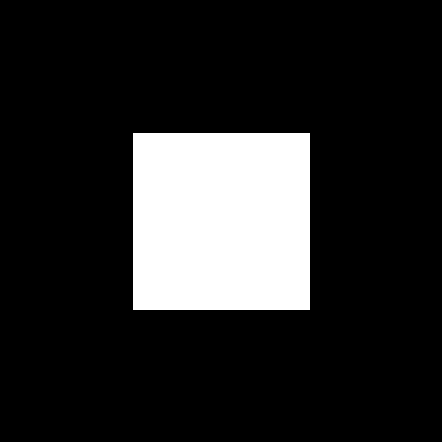

## ES
Implementación del Juego de la Vida de Conway usando orientación a objetos en python. Utiliza SLD2 para mostrar una interfaz con la que se puede interactuar (aún en proceso de mejora). La idea es poder usarlo para experimentar, añadiendo reglas diferentes y alterando la dinámica del juego.

Características:
- Malla que puede crecer indefinidamente (hasta que aguante la memoria).
- Pausa de la generación usando barra espaciadora.
- Alteración del estado de una célula (viva | muerta), pulsando click izquierdo con la generación pausada.
- Desplazamiento por la malla usando click derecho.
- Zoom con la rueda del ratón.

(En progreso)
- Renderizado de una imagen por cada iteración.

# Ejemplo: Malla de 200 x 200 llena de células
(La imagen no se ve nítida por limitaciones de github, pero sí se genera nítida.)

[Video más nítido](doc/output.mp4)